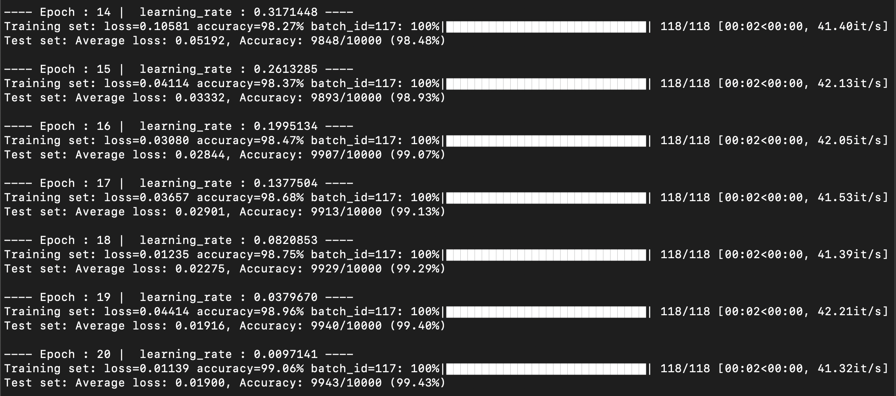

# MNIST Classification with PyTorch

[](https://github.com/dhairyag/tiny_MNIST/actions/workflows/model_checks.yml)

This repository implements a CNN-based deep learning model for MNIST digit classification with automated architecture validation through GitHub Actions.

`main_mnist.py` uses only **3,130 parameters** to achieve more than **99.4%** accuracy, observed in multiple runs. 

### Log Screenshots
Screenshots from two representative runs are shown where the model achieves `>99.4%` accuracy.

#### Run 1 (link to text log file [here](./logs_n_images/log_9945.md))


#### Run 2 (link to text log file [here](./logs_n_images/log_9943.md))


Not all runs achieve the same accuracy. The accuracy depends on the initialization of the model weights. This model achieves more than 99.3% accuracy in almost all runs.

## Model Architecture

The implementation (`main_mnist.py`) features a custom CNN architecture with the following specifications:

### Network Structure
- **Input**: 28x28 grayscale images (1 channel)
- **Total Parameters**: 3,130
- **Output**: 10 classes (digits 0-9)

```bash
==========================================================================================
Layer (type:depth-idx)                   Output Shape              Param #
==========================================================================================
Net                                      [1, 10]                   --
├─Sequential: 1-1                        [1, 6, 14, 14]            --
│    └─Conv2d: 2-1                       [1, 6, 28, 28]            60
│    └─BatchNorm2d: 2-2                  [1, 6, 28, 28]            12
│    └─ReLU: 2-3                         [1, 6, 28, 28]            --
│    └─Conv2d: 2-4                       [1, 6, 28, 28]            330
│    └─BatchNorm2d: 2-5                  [1, 6, 28, 28]            12
│    └─ReLU: 2-6                         [1, 6, 28, 28]            --
│    └─MaxPool2d: 2-7                    [1, 6, 14, 14]            --
│    └─Dropout: 2-8                      [1, 6, 14, 14]            --
├─Sequential: 1-2                        [1, 8, 7, 7]              --
│    └─Conv2d: 2-9                       [1, 8, 14, 14]            440
│    └─BatchNorm2d: 2-10                 [1, 8, 14, 14]            16
│    └─ReLU: 2-11                        [1, 8, 14, 14]            --
│    └─Conv2d: 2-12                      [1, 8, 14, 14]            584
│    └─BatchNorm2d: 2-13                 [1, 8, 14, 14]            16
│    └─ReLU: 2-14                        [1, 8, 14, 14]            --
│    └─MaxPool2d: 2-15                   [1, 8, 7, 7]              --
│    └─Dropout: 2-16                     [1, 8, 7, 7]              --
├─Sequential: 1-3                        [1, 10, 3, 3]             --
│    └─Conv2d: 2-17                      [1, 10, 7, 7]             730
│    └─BatchNorm2d: 2-18                 [1, 10, 7, 7]             20
│    └─ReLU: 2-19                        [1, 10, 7, 7]             --
│    └─MaxPool2d: 2-20                   [1, 10, 3, 3]             --
│    └─Dropout: 2-21                     [1, 10, 3, 3]             --
├─Linear: 1-4                            [1, 10]                   910
==========================================================================================
Total params: 3,130
Trainable params: 3,130
Non-trainable params: 0
Total mult-adds (Units.MEGABYTES): 0.54
==========================================================================================
```

### Layer Configuration

1. **First Convolutional Block** (414 parameters)
   - Conv2D: 1→6 channels, 3x3 kernel, padding=1
   - BatchNorm2D
   - ReLU
   - Conv2D: 6→6 channels, 3x3 kernel, padding=1
   - BatchNorm2D
   - ReLU
   - MaxPool2D (2x2)
   - Dropout (p=0.01)

2. **Second Convolutional Block** (1,056 parameters)
   - Conv2D: 6→8 channels, 3x3 kernel, padding=1
   - BatchNorm2D
   - ReLU
   - Conv2D: 8→8 channels, 3x3 kernel, padding=1
   - BatchNorm2D
   - ReLU
   - MaxPool2D (2x2)
   - Dropout (p=0.01)

3. **Third Convolutional Block** (750 parameters)
   - Conv2D: 8→10 channels, 3x3 kernel, padding=1
   - BatchNorm2D
   - ReLU
   - MaxPool2D (2x2)
   - Dropout (p=0.01)

4. **Classification Head** (910 parameters)
   - Flatten
   - Linear: 90→10 (10*3*3 → 10)
   - LogSoftmax

### Training Configuration

- **Optimizer**: SGD with momentum
  - Maximum Learning Rate: 0.4
  - Momentum: 0.95
  - Weight Decay: 0.0005

- **Learning Rate Schedule**: OneCycleLR
  - Initial Division Factor: 25
  - Final Division Factor: 175
  - Warmup Percentage: 50%

- **Training Parameters**
  - Batch Size: 512
  - Epochs: 20
  - Device: Automatically selects MPS/CUDA/CPU

### Data Augmentation

Only rotation and scaling are used for data augmentation:
- ShiftScaleRotate
  - Shift Limit: 0.0625
  - Scale Limit: 0.05
  - Rotate Limit: 12°
- Normalization
  - Mean: [0.1307]
  - Std: [0.3081]

## GitHub Actions Workflow

The repository includes automated testing through GitHub Actions (`/.github/workflows/model_checks.yml`).

### Automated Tests

The workflow validates four critical aspects of the model architecture:

1. **Parameter Count Verification**
   - Ensures the model maintains exactly 3,130 parameters
   - Validates architectural consistency

2. **Batch Normalization Check**
   - Confirms the presence of BatchNorm2D layers
   - Essential for training stability

3. **Dropout Implementation**
   - Verifies the inclusion of Dropout layers
   - Critical for preventing overfitting

4. **Linear Layer Validation**
   - Checks for proper fully connected layer implementation
   - Validates input (90) and output (10) dimensions

### Running Tests Locally 

```bash
# Install dependencies
pip install torch torchvision pytest

# Run tests
pytest tests/test_model.py -v
```

### CI/CD Integration

The workflow triggers on:
- Push to main branch
- Pull requests to main branch

Uses Ubuntu latest runner with Python 3.8 for consistent testing environment.

## Requirements

- Python 3.8+
- PyTorch
- torchvision
- albumentations
- numpy
- opencv-python
- tqdm
- torchinfo


